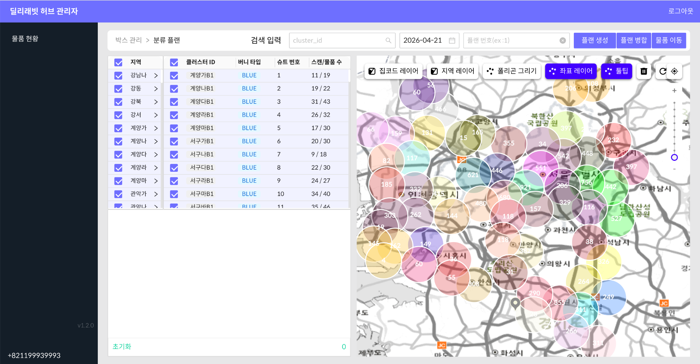
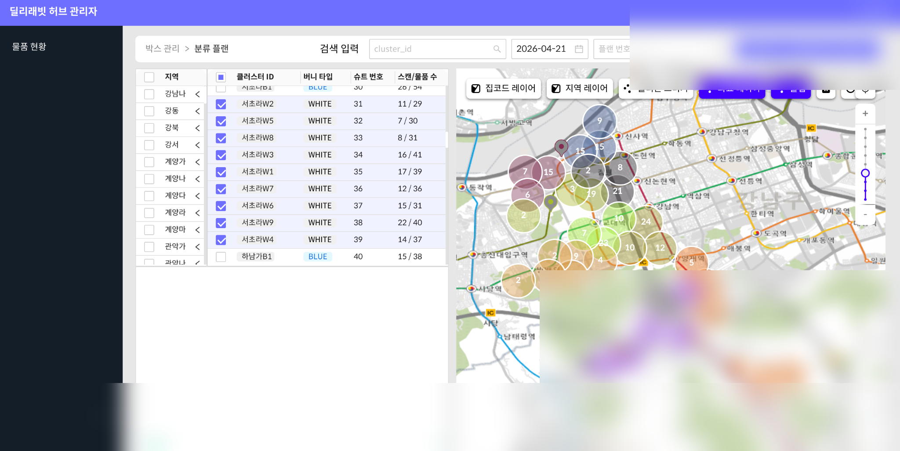

# Delivus Postalcode Clustering Lambda

## 당일배송 허브 운영 병목을 해결한 Production MLOps 시스템

당일배송 허브에서 출차 전 수작업으로 진행되던 클러스터 편집 병목을 자동화하기 위해 구축한 **운영형 배송 클러스터링 시스템**입니다.  
우편번호 그룹 기반 공간 매칭, KMeans++ 클러스터링, 기사 스케줄·MAX 물량 제약 조건, AWS Lambda 기반 자동 운영을 결합하여 실제 허브 운영 KPI를 개선했습니다.

---

## Executive Impact

| Metric | Before | After | Impact |
|---|---:|---:|---|
| 허브 편집 시간 | 39.5분 | 24.3분 | **38% 단축** |
| 평균 배송지 간 거리 | 141.3m | 110.05m | **22% 감소** |
| 추가 주문 편성 | 수작업 | 자동화 | **누락률 0% 유지** |
| 운영 방식 | 수작업 중심 | Lambda 자동화 | 운영자 의존도 감소 |

---

## Business Problem

당일배송 운영에서는 출차 전 짧은 시간 안에 수백 건의 배송 물량을 기사별로 분류해야 합니다.  
기존 방식은 운영자가 지도와 물량을 보며 수동으로 클러스터를 수정하는 구조였기 때문에 다음 문제가 반복적으로 발생했습니다.

- 운영팀의 수작업 편집 시간이 길어짐
- 기사별 물량 불균형 발생
- 출차 지연 및 SLA 변동성 증가
- 클러스터링 이후 추가 유입 주문을 다시 수동 편성해야 함
- 숙련 운영자 경험에 의존하는 구조

이 병목은 단순한 내부 작업 시간이 아니라 **배송 품질, 출차 속도, 운영 비용**에 직접 영향을 주는 문제였습니다.

---

## My Role

본 프로젝트에서 클러스터링 시스템의 설계, 구현, 배포, 운영 개선까지 End-to-End로 담당했습니다.

- 우편번호 그룹 기반 클러스터링 전략 설계
- KMeans++ 기반 초기 클러스터링 로직 구현
- 소형 클러스터 병합 및 비효율 그룹 재조정 로직 구현
- 기사 스케줄 및 기사별 MAX 물량 제약 반영
- 추가 유입 주문을 위한 Overlap Clustering 구현
- AWS Lambda Container Image 기반 서버리스 배치 구성
- S3 결과 저장 및 허브 관리자 앱 연동
- Slack 알림, CloudWatch 로그 기반 운영 모니터링
- KPI 측정 및 지속 개선

---

## Solution Overview

본 시스템은 **ML clustering + spatial matching + operation constraints + serverless automation**을 결합한 구조입니다.

```text
EventBridge Trigger / Manual Trigger
        ↓
AWS Lambda Container
        ↓
MySQL / PostgreSQL Data Load
        ↓
Zipcode Polygon Matching
        ↓
KMeans++ Clustering
        ↓
Constraint Rules
(driver schedule / max capacity / area policy)
        ↓
Overlap Clustering for Additional Orders
        ↓
S3 JSON Save
        ↓
Slack Alert / CloudWatch Logs
        ↓
Hub Admin App
```

---

## Core Process

### 1. Data Loading

배송 아이템, 기사 스케줄, 우편번호 그룹, 지역별 정책 데이터를 로딩합니다.

### 2. Zipcode Polygon Matching

배송지 좌표를 우편번호 그룹 Polygon과 매칭하여 지역 기반 후보 그룹을 생성합니다.

### 3. Initial Clustering

KMeans++를 사용해 배송지 좌표 분포를 기반으로 1차 클러스터를 생성합니다.

### 4. Constraint Adjustment

현장 운영 제약 조건을 반영합니다.

- 기사별 MAX 물량
- 기사 근무 스케줄
- 지역별 운영 정책
- 소형 클러스터 병합
- 과밀/과소 클러스터 재조정

### 5. Overlap Clustering

클러스터링 이후 추가로 유입되는 주문을 기존 클러스터와의 공간 중첩/거리 기준으로 자동 편성합니다.

### 6. Operation Integration

최종 결과를 S3에 저장하고 허브 관리자 앱에서 지도 기반으로 확인할 수 있도록 연동합니다.

---

## Real Operation Screenshots

### Hub Overview



### Cluster Detail



---

## Tech Stack

| Category | Stack |
|---|---|
| Language | Python |
| Data Processing | Pandas, NumPy |
| ML / Clustering | Scikit-learn, KMeans++ |
| Spatial Data | GeoPandas, Shapely |
| Infra | AWS Lambda, AWS SAM, Docker Image |
| Storage | Amazon S3 |
| Scheduler | EventBridge |
| Database | MySQL, PostgreSQL |
| Monitoring | CloudWatch Logs, Slack Webhook |

---

## Repository Structure

```text
lambda/postalcode-clustering/
├── app.py
├── template.yaml
├── Dockerfile
├── utils/
│   ├── run_clustering.py
│   ├── process_region.py
│   ├── overlap/
│   ├── zipcode/
│   └── slack/
└── events/
```

---

## Why This Is Strong MLOps Experience

이 프로젝트는 Notebook 분석 프로젝트가 아니라, 실제 운영 현장에서 사용되는 **Production MLOps 시스템**입니다.

- 비즈니스 병목을 ML 문제로 구조화
- 클러스터링 알고리즘과 운영 제약 조건 결합
- Lambda 기반 서버리스 운영 자동화
- S3 결과 저장 및 운영 시스템 연동
- Slack/CloudWatch 기반 장애 감지 및 운영 모니터링
- KPI 기반 성능 개선

---

## Security / Redaction

포트폴리오 공개를 위해 다음 항목은 제거하거나 샘플 값으로 대체했습니다.

- 실제 DB 접속 정보
- 실제 AWS Account ID
- 실제 S3 Bucket 이름
- 내부 운영 테이블명 일부
- 실제 배송 데이터 및 고객 정보
- 배포용 `samconfig.toml`

---

## Key Takeaway

> 허브 출차 병목을 해결하기 위해 ML 클러스터링 시스템을 직접 설계·배포·운영했고,  
> AWS 기반 자동화 파이프라인으로 실제 운영 KPI 개선을 만든 Production MLOps 프로젝트입니다.
